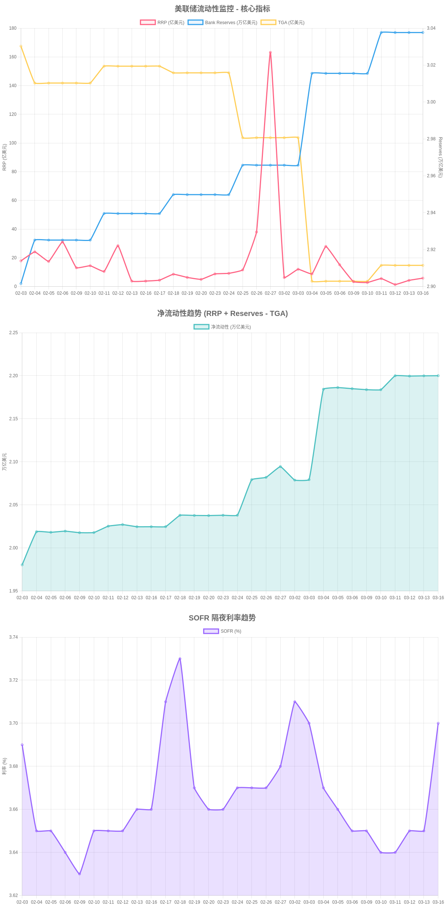

# 美联储流动性监控系统

一个全面的美联储流动性指标监控系统，提供专业图表和智能分析。

## 功能特性

- 📊 实时监控 RRP、银行准备金、SOFR、TGA
- 📈 专业PNG图表，展示30天趋势
- 🤖 智能分析和风险评估
- 📱 自动发送到Telegram（文本+图片）
- 💾 智能持久化存储，增量更新
- ⏰ 每天自动报告（上海时间8:00和20:00）

## 快速开始

### 安装

1. 复制所有文件到OpenClaw工作区：
```bash
cp -r liquidity-monitor /root/.openclaw/workspace/skills/
```

2. 安装依赖：
```bash
npm install chartjs-node-canvas canvas
```

3. 配置（可选）：
```bash
# 编辑 liquidity-config.json 自定义阈值
```

### 使用

#### 手动运行

```bash
# 完整报告（文本+图片发送到Telegram）
node liquidity-report.js [telegram_user_id]

# 只生成图表
node liquidity-chart.js

# 只更新数据
node liquidity-storage.js update

# 查看统计
node liquidity-storage.js stats
```

#### 触发词

在Telegram中发送：
- "宏观数据"
- "流动性监控"
- "liquidity"

#### 自动报告

通过OpenClaw cron任务设置：
```json
{
  "name": "流动性监控",
  "schedule": {
    "kind": "cron",
    "expr": "0 0,12 * * *",
    "tz": "Asia/Shanghai"
  },
  "payload": {
    "kind": "agentTurn",
    "message": "运行流动性监控报告"
  },
  "sessionTarget": "isolated"
}
```

## 输出示例

### 文本报告

```
💧 流动性监控
📅 2026-03-17

核心指标：
• 💵 RRP（逆回购）：5.82 亿 ⚠️
• 🏦 Bank Reserves（银行准备金）：3.04 万亿 ✅
• 📈 SOFR（担保隔夜融资利率）：3.70% ✅

风险评估：
• 🔴 风险
• 🔴 RRP接近0，流动性紧张

💰 净流动性：2.20 万亿
• TGA：8382亿，🔴 月底回收118亿

📖 数据解读：
• RRP极度紧张：当前5.8亿，接近枯竭
• TGA回收预期：月底需回收118亿

🎯 综合结论：
市场流动性处于紧张状态，需密切关注。
```

### 图表



- 1200x2440px PNG图片
- 3张图表合并
- 30天趋势

## 配置

编辑 `liquidity-config.json`：

```json
{
  "thresholds": {
    "rrp": {
      "critical": 100,
      "warning": 500,
      "abundant": 2000
    },
    "reserves": {
      "critical": 2500,
      "warning": 2800,
      "abundant": 3000
    }
  },
  "tgaTargets": {
    "03": { "endTarget": 8500 }
  }
}
```

## 数据源

- **FRED API**（美联储经济数据）
  - RRP: RRPONTSYD
  - 准备金: WRESBAL
  - SOFR: SOFR
  - TGA: WTREGEN

## 架构

```
liquidity-monitor/
├── SKILL.md                    # 技能定义
├── README.md                   # 本文件
├── liquidity-monitor.js        # 核心监控（445行）
├── liquidity-chart.js          # 图表生成（272行）
├── liquidity-storage.js        # 数据持久化（207行）
├── liquidity-report.js         # 报告发送（65行）
└── liquidity-config.json       # 配置文件
```

## 性能

- 完整运行：约15秒
- 数据更新：约3秒
- 图表生成：约8秒
- 消息发送：约4秒

## 依赖

- Node.js v14+
- chartjs-node-canvas
- canvas
- curl
- OpenClaw

## 限制

- RRP/SOFR：T+1数据（次日更新）
- 准备金/TGA：每周三更新
- FRED API：无速率限制，但建议避免频繁请求

## 版本

**v3.0.0** - 2026-03-17

## 作者

大富小姐姐 🎀

## 许可证

MIT
